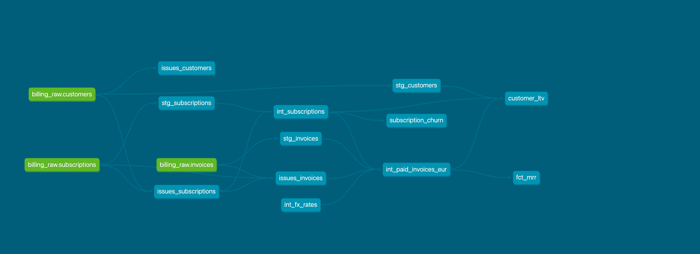

# NordStack: Data Engineer Take-Home

An analytics layer over a fictional B2B SaaS billing system.

```
seed_data/*.csv  →  MySQL  →  dlt  →  PostgreSQL raw  →  dbt  →  marts
```

MySQL plays the operational billing source. dlt syncs it into the PostgreSQL `raw`
schema. dbt builds three marts: MRR, customer LTV and churn. Airflow runs the pipeline
every five minutes; GitHub Actions validates changes before merge.

The dataset is small, 3,151 rows in three tables, so the implementation stays simple.
The decisions worth discussing are about what happens on the second run, on a retry, and
on a bad source record.

---

## Architecture

```
                        seed_data/*.csv
                              │
                              ▼
                            MySQL                    simulated billing source
                              │
                             dlt                     replace, business key declared
                              │
                              ▼
                       PostgreSQL raw                mirrors the source, defects included
                              │
                  ┌───────────┴───────────┐
                  │                       │
                  ▼                       ▼
          raw quality tests          data_issues
          severity: warn             issues_* models, built from raw
                  │
                  ▼
               staging                                rename, cast, normalize, light repair
                  │
                  ▼
            intermediate                              reusable business logic
                  │
                  ▼
                marts                                 error-severity tests
                  │
          ┌───────┼───────┐
          ▼       ▼       ▼
         MRR     LTV    Churn
```

**Detection reads raw, not staging.** That is what lets staging normalize freely. If
`issues_*` read staging, a cleaned `'PAID '` would already look valid and the defect
would vanish from the audit trail.

---

## Quick start

```bash
cp .env.example .env
docker compose up -d                        # MySQL + Postgres; wait for "healthy"

python -m venv venv && source venv/bin/activate
pip install -r requirements.txt

python ingestion/bootstrap_mysql.py          # CSVs  → MySQL
python ingestion/sync_mysql_to_postgres.py   # MySQL → Postgres raw

cd dbt
uv run dbt deps
uv run dbt build                             # models + tests, dev target
uv run dbt docs generate
uv run dbt docs serve --port 8081            # 8080 is taken by Airflow
```

Both ingestion scripts are safe to re-run: counts stay at 121 / 175 / 2,855.

```bash
export AIRFLOW_HOME="$(pwd)/airflow"
airflow standalone                           # UI on :8080
airflow dags test nordstack_analytics        # one full run, no scheduler
```

Connection details: [CONNECTION_DETAILS.md](CONNECTION_DETAILS.md).

---

## Key decisions

| Decision | Choice | Reason |
|---|---|---|
| Source boundary | MySQL → dlt → Postgres | exercises real ingestion, not seeding |
| Write disposition | `replace` | keeps the planted duplicates; reruns are idempotent |
| Raw tests | warn | detect source defects without blocking the build |
| Issue detection | built from raw | catch defects before staging normalizes them away |
| Staging | format, standardization, light repairs | labels may be repaired, numbers may not |
| Intermediate models | a modular surface the marts compose from | one definition of revenue, of usable subscriptions, of an FX rate, shared across domains; single-mart logic stays in its mart |
| Mart tests | error | the published contract has to hold |
| Deduplication | dbt staging | visible and tested, not a side effect of ingestion |
| FX | static mapping | allowed by the brief; dated rates are a production concern |
| Default dbt target | `dev` | production has to be chosen, never inherited |
| CI selection | `state:modified+` with baseline | shows the pattern at almost no cost |

**On `replace` rather than `merge`:** dlt's merge deduplicates on the primary key before
writing, so it would collapse the planted duplicates `C0023` and `S00006` during
ingestion and load 120/174 rows instead of 121/175, quietly fixing the data the tests are
meant to catch. `replace` reloads rather than appends, so retries converge on the same
counts, and deduplication moves to dbt staging where it is visible and tested.

---

## Data quality

The source ships with planted defects. The question is where each kind of problem belongs.

```
source defect              → warn        raw tests, visible in every build, never block it
rule breach                → recorded    data_issues, built from raw
record that cannot be used → quarantined excluded_from_marts, never reaches a consumer
trusted contract violated  → error       mart tests, fail the build
```

Two words, used precisely. A row is **flagged** when it breaks a rule: recorded in
`data_issues`, still counted in the marts. It is **quarantined** when it also carries
`excluded_from_marts`. 29 rows are flagged; 21 of those are quarantined.

Each `issues_*` model carries one boolean per rule breached rather than a single reason
column, so a row breaking three rules reports all three.

### What was found

| Issue | Example | Handling |
|---|---|---|
| Duplicate business key | `C0023`, `S00006` | deduplicated in staging, flagged; the rows are identical, so nothing is lost |
| Orphan foreign key | `S00011`→`C9999`, `I000601`→`S99999` | quarantined |
| Negative money | `S00048` (−99.00) and its 7 invoices | quarantined |
| Paid invoice with null amount | `I000322` | quarantined, not imputed |
| `end_date` before `start_date` | `S00034` | flagged; excluded from churn only |
| Cancelled with a future `end_date` | `S00020`, `S00139`, `S00167` (2027) | not a defect: kept, marked `is_future_cancellation`. In a real project I would confirm the treatment with a domain expert |
| Casing and trailing whitespace | `'ACTIVE'`, `'PAID '` | normalized in staging, flagged |
| Blank country | `C0008` | labelled `UNKNOWN` in staging, flagged |
| Malformed email | `C0016` | flagged only; the `email` column doesn't feed any mart |
| Future `created_at` | `C0041` (2027) | flagged |
| Non-EUR currency | 2 SEK invoices | converted with a static rate |

`data_issues` holds 4 customers, 5 subscriptions and 20 invoices. 19 invoices and 2
subscriptions are withheld from the marts; every flagged customer still reaches them,
because no customer defect justifies withholding real revenue.

Three cases had no obvious answer:

- **`S00034`**. `end_date` precedes `start_date`, yet it billed for 16 months afterwards
  (€3,887 paid). The billing history is more reliable than the date, so the revenue stays
  in MRR and LTV and only the churn month is dropped. Churn covers 49 of 52 cancellations.
- **SEK invoices**. Treated as a real currency and converted, not as mislabelled EUR.
- **`I000322`**. Quarantined, not imputed. Inventing €99 of revenue is worse than losing
  the row.

The build is green because unusable records are excluded upstream, not because tests were
weakened: **40 pass, 12 warn, 0 errors.**

---

## Modelling

**Staging** renames, casts, normalizes, deduplicates and applies light repairs. A blank
country becomes `'UNKNOWN'` here, so every consumer sees the gap the same way. The line is
drawn at labels: repairing a label is safe because detection still flags the row, but
repairing a number changes a figure. So a negative price stays negative and a null amount
stays null; both are quarantined instead.

**Intermediate** is the modular surface the marts are composed from. Each model
resolves one thing once: which invoices count as revenue and in what currency, which
subscriptions the marts may use, what an FX rate is. The marts then express the rules of
their own domain, revenue by plan, customer value, churn, without re-deriving that base,
and a change to a shared definition happens in one place rather than three. Logic used by
a single mart stays in that mart, so the layer does not fill up with indirection.

**Marts**

| Model | Grain | Definition |
|---|---|---|
| `fct_mrr` | month × plan | sum of paid invoice amounts in EUR, by invoice month |
| `customer_ltv` | customer | total paid revenue, with country, plan mix, current status |
| `subscription_churn` | cancellation month | cancellations and MRR lost, from `monthly_price` |

MRR is recognised revenue, not contracted value. The brief asks for MRR from paid
invoices, so open and failed invoices count for nothing. The two definitions agree for a
subscription paying on time and diverge exactly where payment failed.

Both marts total €322,890.01, and a mart test asserts that on every build.

**FX assumption:** reporting currency is EUR, converted with a static mapping
(`SEK → 0.087`) as the brief allows. It affects one paid invoice, worth €26 of €322,890.
`int_paid_invoices_eur` joins the rate table with an INNER join, so a currency with no
rate cannot reach revenue at face value.

Materializations follow current volume: views everywhere except the marts, which are
tables.



---

## Orchestration

One DAG, [`nordstack_analytics`](airflow/dags/nordstack_analytics.py), on the five-minute
schedule the brief asks for, emailing on success and failure.

```
dlt_sync  →  validate_raw  →  dbt_build  →  email
```

Three tasks rather than one script, so a failure names itself: ingestion, a warehouse that
disagrees with the source, or a modelling problem. Airflow retries only the failed task.

| Setting | Value | Reason |
|---|---|---|
| `retries` | 2, 30s apart | transient infrastructure errors only |
| `execution_timeout` | 4 min | a task outliving the interval is stuck, not slow |
| `dagrun_timeout` | 4 min | under the schedule, so runs cannot pile up |
| `catchup` | `False` | backfilling five-minute intervals gains nothing |
| `max_active_runs` | 1 | two runs replacing the same tables would race |

Retries are for transient failures. Broken SQL or a failed data-quality test fails
identically every attempt and should stay visible instead of spinning.

Two traps this caught. `PythonOperator` only fails a task if the callable *raises*, and
both ingestion scripts are CLIs that **return** an exit code, so a failed load reported
green until an adapter converted the code into an exception. And `validate_raw`
deliberately repeats a check the sync script already does, because a loader that reports
success while leaving the warehouse wrong is exactly what a self-check cannot catch. Both
verified by breaking them on purpose.

**Environment isolation.** Only one database exists, so targets separate by schema.
`dbt_build` resolves its target per run: the run's `dbt_target` param, then `DBT_TARGET`,
then `dev`. `dev` is the only fallback, so `prod` has to be chosen deliberately.

This protects the dbt layer and nothing else. `dlt_sync` writes `analytics.raw` whatever
target is selected. Tolerable here because the source is static and `replace` is
idempotent; not tolerable once raw has consumers. See Next steps.

---

## CI/CD

| Workflow | Trigger | Builds | Target |
|---|---|---|---|
| [`dbt-ci.yml`](.github/workflows/dbt-ci.yml) | pull request | `state:modified+` | `dev` |
| [`dbt-cd.yml`](.github/workflows/dbt-cd.yml) | merge to `main`, or manual | everything | `prod` |

CI runs only when `dbt/`, `ingestion/` or `seed_data/` change. `state:modified+` selects
changed models plus everything downstream. The `+` is what stops a break hiding behind
an untouched consumer. Verified on a real PR: editing `stg_invoices` rebuilt
`int_paid_invoices_eur`, `fct_mrr` and `customer_ltv`, and skipped `subscription_churn`.

CD builds everything, because a deployment must leave production consistent.
`DBT_TARGET=prod` is set in exactly one place, the CD workflow. CI leaves it unset, so a
pull request cannot write to production.

**The honest cost of Slim CI here.** `--defer --state` needs a manifest to compare against
and real tables to resolve to. A GitHub runner has neither, so CI builds the base branch
first to have something to defer against. Measured: baseline 5s, selective build 5s, dbt
10s of a 1m51s run. At this size selective building costs more than it saves. It stays
because swapping the baseline for a real production manifest is a one-step change.

This is CI, not CD in the deployment sense; there is no persistent platform to deploy to.

---

## Next steps

### What I would build next

**Separate the dbt repository** and pull it in as a submodule, so one dbt project can serve
the whole data department rather than this pipeline alone.

**End-to-end CI/CD.** Today it covers dbt only. It should also validate the Airflow layer
(DAG imports, DAG ID, schedule, task dependencies) and run the ingestion scripts against
throwaway services.

**Semantic layer,** so MRR, LTV and churn are defined once for BI tools instead of being
re-implemented per dashboard.

**Dated FX rates** (`date | currency | eur_rate`) loaded by their own pipeline, each
invoice converted at the rate for its accounting date.

### Production mindset: decisions waiting on a trigger

Not implemented, and building them here would be cost without benefit. They are worth
stating because the useful skill is knowing the condition that makes a pattern correct, and
being able to say why it has not been met.

**Ingestion strategy.** `replace` is right here because the duplicates are planted and must
survive. A real billing system would have a genuine unique ID per table, enforced at the
source; with reliable keys, `merge` is the natural choice, and CDC after that.

> Trigger: enforced keys at the source, plus a full reload that costs real time or money.

**Materializations.** Incremental for large, frequently rebuilt marts. It brings its own
questions (`unique_key`, late-arriving data, lookback windows, full refresh), each of
which can silently produce wrong numbers if answered badly.

> Trigger: model runtime or warehouse cost measured, not assumed.

**A dev analytics database.** Today `dev` and `prod` are schemas in one database sharing one
`raw`, so testing an ingestion change means writing into the tables production reads. A real
platform separates at the database:

```
  PRODUCTION                                DEVELOPMENT

  MySQL, live billing                       MySQL read replica or
        │                                   sanitized snapshot
  Airflow, prod deployment                        │
        │  dlt_sync                          Airflow, local or dev
        ▼                                         │  dlt_sync
  analytics_prod.raw ───── clone or subset ─────► analytics_dev.raw
        │                  one direction only           │
        │  dbt --target prod, CD only                   │  dbt --target dev
        ▼                                               ▼
  analytics_prod.marts                        analytics_dev.dbt_<developer>
        │
        ▼
  BI, reverse ETL, consumers
```

The same DAG file runs in both columns; the deployment supplies the connections. The two
routes into `analytics_dev.raw` are alternatives: clone prod raw when changing dbt models,
run `dlt_sync` against the replica when changing ingestion code.

> Trigger: more than one person developing, or a production raw layer consumers depend on.

---

## Closing

The dataset is small, so the implementation is simple. That does not have to mean
careless. Raw keeps its defects visible, unusable records are isolated before the trusted
path, marts enforce contracts that fail the build, retries are bounded, dev and prod are
separated, and CI validates changes before merge.

Those boundaries are the part that scales: ingestion, materializations and CI/CD can each
change later without disturbing the rest.
